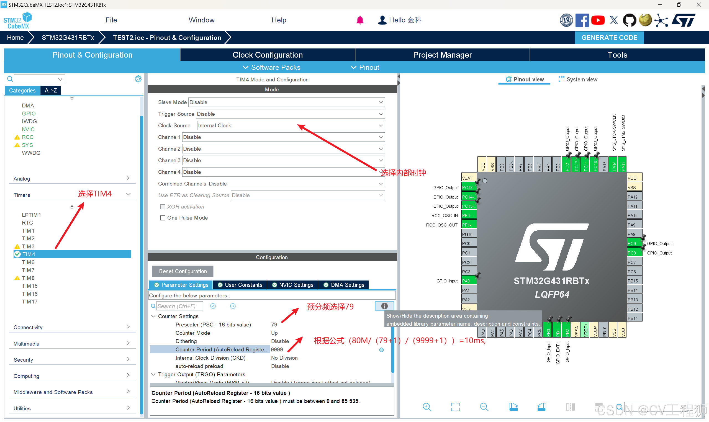

## GOIO_PIN
1. `HAL_GPIO_WritePin` : 函数用于将指定的 GPIO 引脚设置为指定的电平（高或低）
 
2.  ` HAL_GPIO_TogglePin `: 函数则用于切换指定 GPIO 引脚的电平状态，即如果当前是高电平，则切换为低电平；如果当前是低电平，则切换为高电平

3.  

## 定时器
 1. `HAL_TIM_PeriodElapsedCallback(TIM_HandleTypeDef *htim)`：定时器中断回调函数，它在定时器周期到期时自动被调用
    
    1. cubemx配置： TIMER->mode/Clock Source:(Intermal Clock)"选择内部时钟"->Configuration->Parameter Settings ->Prescaler and Counter Period 依据（80M/(Prescaler-1)/( Counter Period+1)）->==NVlC Settings==使能中断
    2. 代码用法
    - `MX_TIM4_Init()`：初始化定时器
    - ` HAL_TIM_Base_Start_IT(&htimX)`：启动TIMX
    - `if (htim->Instance == TIM2)`：判断哪个定时器发生中断
    - 代码示例
 ```
 void HAL_TIM_PeriodElapsedCallback(TIM_HandleTypeDef *htim)
{
    if (htim->Instance == TIM2)  // 检查是哪个定时器触发了中断
    {
        // 执行定时器溢出时的操作
        // 例如：周期性更新 LED 状态、计数等
    }
}

```
2. `SysTick 定时器`：是 STM32 内核自带的定时器。它是一个 简单的 24 位递增定时器，通常用来提供固定的时间基准，如 1ms 中断。
   1. cubemx配置：
   2. 代码用法：