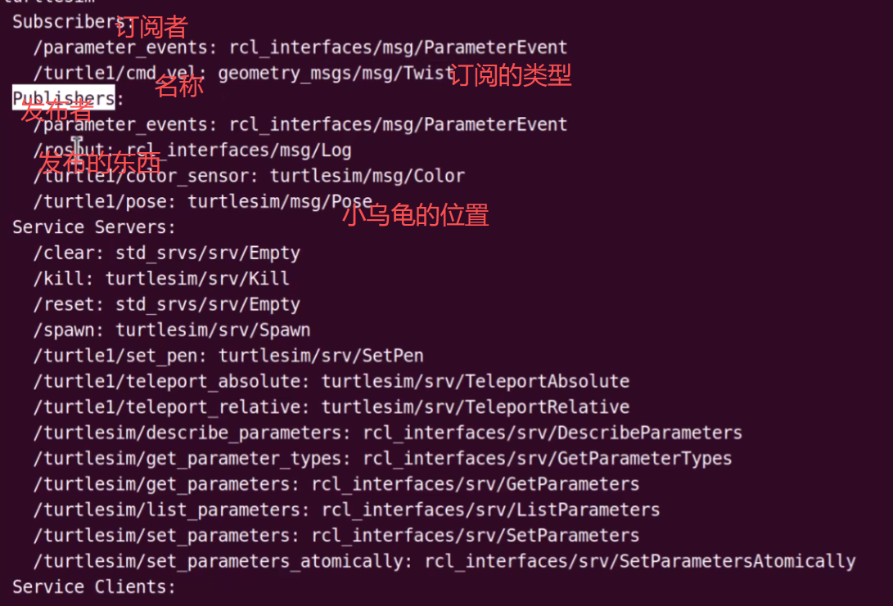

##话题通信控制机器人
1. 运行乌龟节点
` ros2 run turtlesim turtlesim_node `
2. 查看节点运行列表（另开）
`ros2 node list`
查看节点信息
`ros2 node info /turlesim`

+ `/turtlel/cmd_vel: geometry_msgs/msg/Twist`话题用来控制小海龟
+ `/turtlel/pose:turtlesim/msg/Pose`话题用来读取小海龟位置
3. 读取话题内容
 `ros2 topic echo /turtlel/pose`
4. 查看话题的信息
 `ros2 topic onfo /turtlel/cmd_vel`查看话题的消息接口，订阅者和发布者，谁控制小海龟谁发布，订阅者：小海龟
`ros2 interface show geometry_msgs/msg/Twist`查看消息接口的信息
5. 发布话题（控制小海龟）
`ros2 topic pub /turtlel/cmd_vel geometry_msgs/msg/Twist "{linear: {x: 0.5, y: 0.0}, angular: {z: 0.0} }"`
+ /turtlel/cmd_vel 话题的名字
+ geometry_msgs/msg/Twist 消息的接口
+ "{linear: {x: 0.5, y: 0.0}, angular: {z: 0.0} } 发布话题的内容